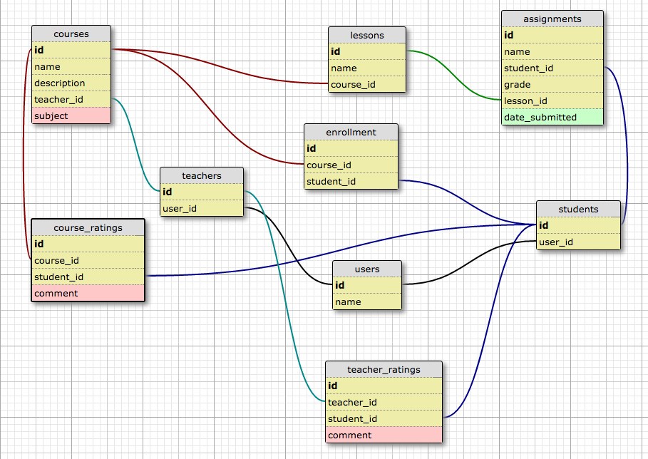

# Java Courseware
Version 0.0.0: October 7, 2016

by
* [Brian](https://github.com/)
* [Elysia](https://github.com/)
* [Ewa](https://github.com/)
* [Karen Freeman-Smith](https://github.com/karenfreemansmith)
* [Sara Jensen](https://github.com/thejensen)

## Description
Group Project for Week 5, Java at Epicodus - A web-based platform to create and administer courses of all types.

A web-based platform that provides a space for teachers to upload courses that anyone can express interest in enrolling for online. Courses are not necessarily connected to each other meaningfully. The online platform is maintained and features are expanded by the software company that runs it.

*Distributed software that can be used by universities, schools and other educational institutions to manage their courses. Courses are connected to each other by the nature of the use of the software by the institution. Software is used and branding is customized by the buyer*

### Specifications
#### User Stories:

##### MVP (Musts)
* As a teacher, I want to be able to create a course
  * As a teacher, I want to upload course materials as links or as simple text
  * As a teacher I want to see all the students in the course
  * As a teacher, I want to be able to see my student's grades
  * As a teacher, I want to be able to be able to access and grade students' assignments
  * As a teacher, I want to be able to see students' cumulative grades
* As a teacher, I want to be able to see all my students by course
* As a teacher, I want to be able to see all my courses
* As a teacher, I want to navigate to the courses I am teaching.
* As a teacher, I want some indication if I have assignments that need grading

* As a student, I want to access the lessons and assignments for a course
* As a student, I want to submit my assignments
* As a student, I want to be able to see my grades
* As a student, I want to see all available courses
* As a student, I want to be able enroll in a course
* As a student, I want to navigate to the courses in which I am enrolled.

##### Future Features 1 (would be nice)
* As a teacher, I want to upload course materials to different templates (abstract lessons to diff lessons - ex: lecture link instead of text)
* As a teacher, I want to control how enrollment works for my course
  * As a teacher, I want to accept students manually in my class
  * As a teacher, I want to set a course to accept students automatically
  * As a teacher, I want to be able to set a maximum class size
  * As a teacher, I want to choose between a set term model or a go at your own pace model
  * As a teacher, if I choose the set term model, I want/need to set a class minimum size
  * As a teacher, I want the site to generate a syllabus for me based on the course and lesson info
* As a student, I want to signal my desire for enrollment in a course
* As a student, I want to see the enrollment conditions for a course
* As a teacher, I want to set students' assignments to be public or private
* As a teacher, I want to be notified when a student submits an assignment
* As a teacher, I want to take a course.
* As a teacher, I can set whether a course requires payment or not  (and how much that payment is)
* As a student, I want to see how much a course costs/filter courses by free/price etc. --> general search function
* As a student, I want to be able to sort/filter courses by teacher, category etc.
* As a teacher, I want to be able to sort/filter students

* As a student, I want to teach a course.

##### Future Features 2 (probably not happening)
  * As a teacher, I want to set prereqs for a course
  * As a student, I want to see prereqs for a course
  * As a teacher, I want to see my course ratings
  * As a teacher, I only want students who are taking/have taken my course, to be able to rate it/rate me
  * As a student, I want to be able to rate a course
  * As a student, I want to be able to see the avg rating of a course
  * As a student, I want to be able to rate a teacher
  * As a student, I want to be able to see the avg rating of a teacher
  * As a teacher, I want to be able to see the ratings for my courses
  * As a teacher, I want to be able to link my courses into a track or collaborate with other teachers to link their courses into one
  * As the website owner, I want to adjust the branding of my website for my school/university.
  * As a website owner, I want to set rules about how payments work

#### Database Diagram:

(create diagram at - http://ondras.zarovi.cz/sql/demo/  )

#### Technical Specifications:
( add chart, make table at - http://www.tablesgenerator.com/markdown_tables )

## Setup/Installation
* Clone directory
* Setup database in PSQL:
  * ...
* Type 'gradle run' inside the directory
* Navigate to 'http://localhost:4567'

## Support & Contact
For questions, concerns, or suggestions please email karenfreemansmith@gmail.com

## Known Issues
* N/A

## Technologies Used
Java, JUnit, Spark, PostgreSQL, Gradle

## Legal
*Licensed under the GNU General Public License v3.0*

Copyright (c) 2016 Copyright _Brian, Elysia, Ewa, Karen Freeman-Smith, & Sara Jensen_ All Rights Reserved.
